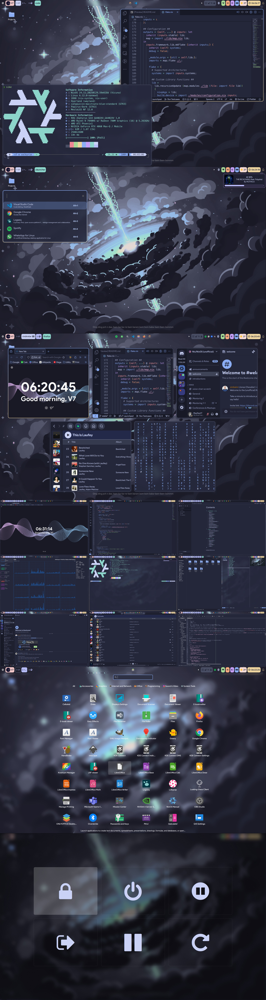
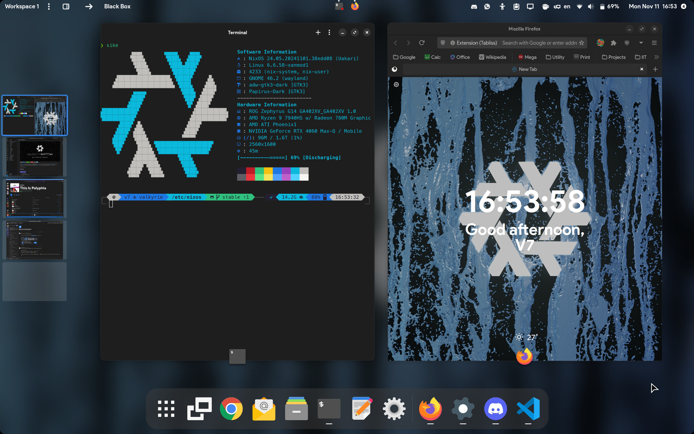
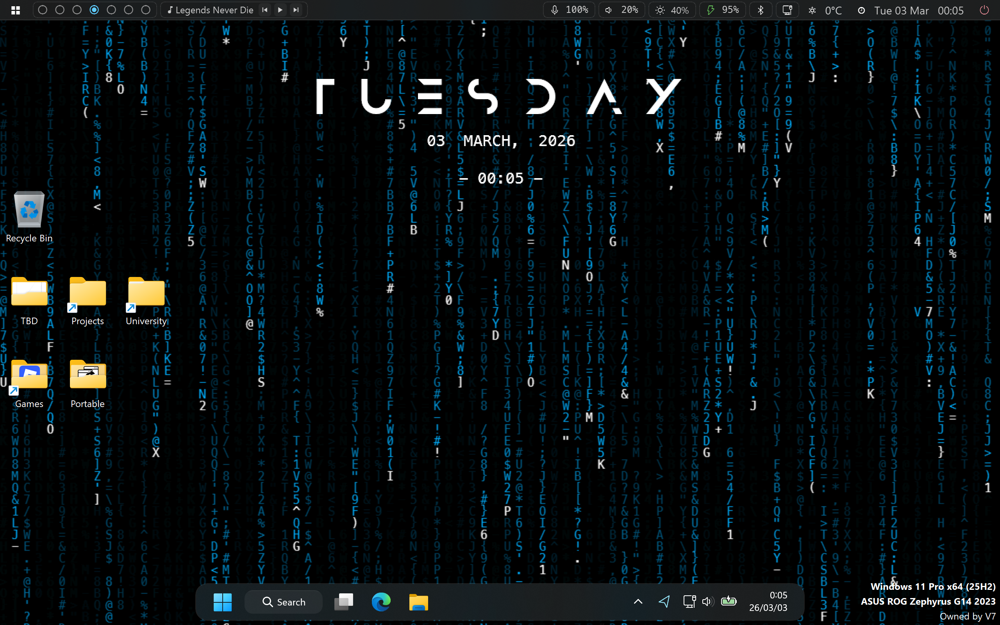
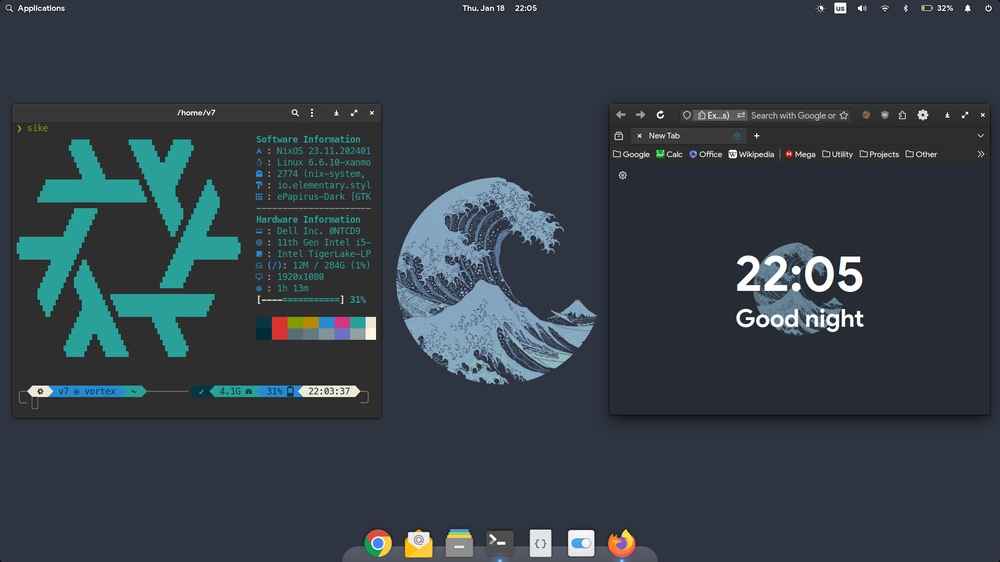
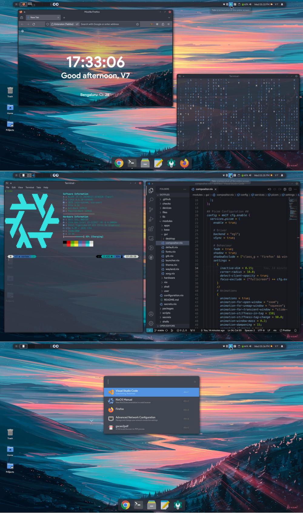
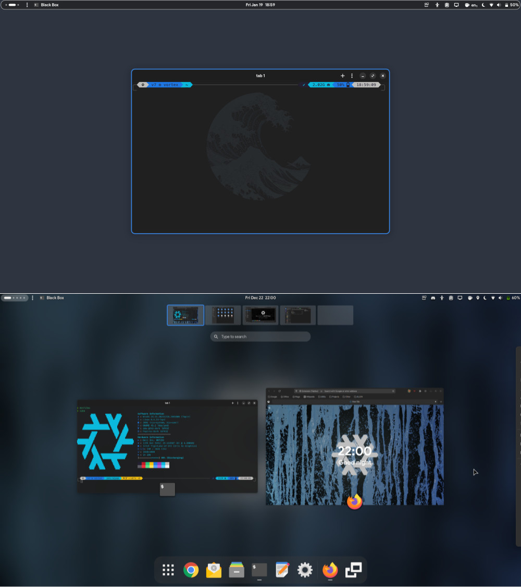
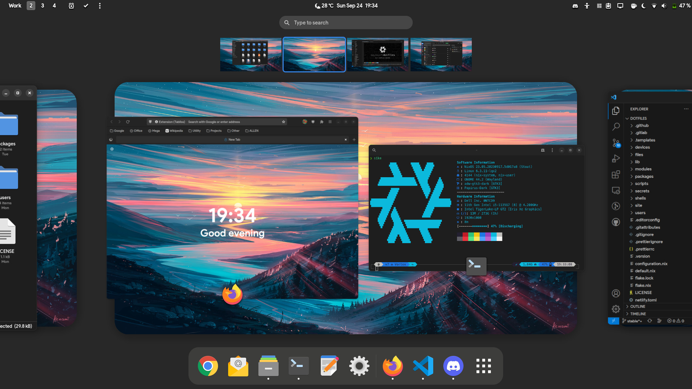
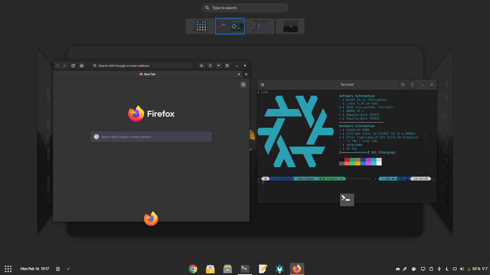

<picture>
  <source media="(prefers-color-scheme: light)" srcset="./files/images/banner-light.png"/>
  <source media="(prefers-color-scheme: dark)" srcset="./files/images/banner-dark.png"/>
  
</picture>

[](https://nixos.org)
<picture><source media="(prefers-color-scheme: dark)" srcset="https://www.shieldcn.dev/github/license/maydayv7/dotfiles.svg?variant=ghost&size=sm&mode=dark&font=jetbrains-mono">

</picture>
<picture><source media="(prefers-color-scheme: dark)" srcset="https://www.shieldcn.dev/github/last-commit/maydayv7/dotfiles.svg?variant=secondary&size=sm&mode=dark&font=jetbrains-mono">

</picture>

This directory contains the configuration and `dotfiles` for my continuously evolving multi-PC setup (using [Nix](https://nixos.org/)).
All the devices I own, controlled by code.
It also builds and deploys my website to [maydayv7.cc](https://maydayv7.cc).

<details>
<summary><b>Pictures</b></summary>

**_Note:_** These may be outdated

|  |
| :----------------------------------------------: |
|                    _Hyprland_                    |

|  |
| :------------------------------------------------: |
|                  _GNOME Desktop_                   |

|                    Windows                     |
| :--------------------------------------------: |
|  |
|                                                |

<details>
<summary>Theming</summary>

- [Starship](https://starship.rs/) Prompt Theme: Minimal, blazing-fast, and infinitely customizable prompt for any shell
- [Bibata Cursor](https://github.com/ful1e5/Bibata_Cursor): Compact and material designed cursor set
- [Papirus Icon Theme](https://github.com/PapirusDevelopmentTeam/papirus-icon-theme): Pixel perfect icon theme for Linux
- [Catppuccin](https://github.com/catppuccin) Theme: A community-driven Pastel Theme consisting of 4 soothing warm Flavors with 26 eye-candy Colors each

- [Adwaita GTK3](https://github.com/lassekongo83/adw-gtk3): Theme from `libadwaita` ported to GTK3
- [KvLibadwaita](https://github.com/GabePoel/KvLibadwaita) Kvantum Theme: Integrates QT Apps with GNOME Desktop
- Firefox [GNOME Theme](https://github.com/rafaelmardojai/firefox-gnome-theme): GNOME Theme for the Mozilla Firefox Browser
- VS Code [Adwaita Theme](https://github.com/piousdeer/vscode-adwaita): Integrates Visual Studio Code with GNOME Desktop
- Discord [GNOME Theme](https://github.com/ricewind012/discord-gnome-theme): A GNOME theme for Discord, following the Adwaita style & GNOME HIG
- Obsidian [Adwaita Theme](https://github.com/birneee/obsidian-adwaita-theme): A GNOME Adwaita theme for Obsidian

</details>

<details>
<summary><i>Older...</i></summary>

|  |
| :------------------------------------------------------: |
|                    _Pantheon Desktop_                    |

| [](https://www.reddit.com/r/unixporn/comments/19efxry/xfce_functional_and_beautiful/) |
| :-----------------------------------------------------------------------------------------------------------------------------------: |
|                                                            _XFCE Desktop_                                                             |

|  |
| :--------------------------------------------------: |
|                      _GNOME 45_                      |

|  |
| :--------------------------------------------------: |
|                      _GNOME 44_                      |

| [](https://www.reddit.com/r/unixporn/comments/ssb7mf/gnome_my_dream/) |
| :-----------------------------------------------------------------------------------------------------------------------: |
|                                                        _GNOME 41_                                                         |

</details>

</details>

## Features


- Device-Agnostic
- Convenient and Automated
- Hermetically Reproducible
- Declarative and Derivational
- Atomic, Generational and Immutable

#### Notable Features

- Supports multiple users and devices
- Configuration for multiple DEs and Compositors
- Incorporates PipeWire, Wayland, ...!
- Automatically builds and deploys my [Website](./site)
- Credentials management using the [`sops-nix`](https://github.com/Mic92/sops-nix) module and [`gnupg`](https://gnupg.org/) keys
- Comprehensive User Configuration using the [`home-manager`](https://github.com/nix-community/home-manager) module
- Ephemeral, opt-in filesystem state using the [`impermanence`](https://github.com/nix-community/impermanence) module and [ZFS](https://zfsonlinux.org/)
- Declarative disk partitioning and installation using [`disko`](https://github.com/nix-community/disko)
- Support for Secure Boot using [`lanzaboote`](https://github.com/nix-community/lanzaboote)
- Multiple development [`shells`](./shells) integrated with [`direnv`](https://direnv.net/) and [`lorri`](https://github.com/nix-community/lorri)
- Automatic `packages` updates using [`update.sh`](./packages/update.sh)
- Syntax [formatting](./modules/core/checks.nix) using [`treefmt`](https://github.com/numtide/treefmt)
- Support for `source` filters with [`nix-filter`](https://github.com/numtide/nix-filter)
- Support for Base16 color theming using [`stylix`](https://github.com/danth/stylix)
- Support for declaratively installing [Flatpak](./modules/apps/flatpak.nix) applications using [`nix-flatpak`](https://github.com/gmodena/nix-flatpak)
- Support for Android Virtualisation using [Waydroid](https://waydro.id/)
- Support for VFIO PCI Device Passthrough with a declarative, performant Windows VM using [NixVirt](https://github.com/AshleyYakeley/NixVirt) and [Looking Glass](https://looking-glass.io/) (see my [blog post](https://maydayv7.cc/blog/nixos/win11vm))

## Programs

| Type     |                                                           Programs                                                           |
| :------- | :--------------------------------------------------------------------------------------------------------------------------: |
| Editors  | [`nano`](https://www.nano-editor.org/), [`micro`](https://micro-editor.github.io), [VS Code](https://code.visualstudio.com/) |
| Shells   |                          [`bash`](https://www.gnu.org/software/bash/), [`zsh`](https://www.zsh.org)                          |
| Terminal |                          [Ghostty](https://ghostty.org/), [Kitty](https://sw.kovidgoyal.net/kitty/)                          |
| Browser  |                                      [Firefox](https://www.mozilla.org/en-US/firefox/)                                       |
| Desktops |            [GNOME](https://www.gnome.org), [Hyprland](https://hypr.land/), [Niri](https://github.com/YaLTeR/niri)            |

## Structure

**_Overview of File Hierarchy_**

<details>
<summary><b>Outputs</b></summary>

```shellsession
$ nix flake show
github:maydayv7/dotfiles
├───apps
│   └───x86_64-linux
│       ├───sysutils: app
│       ├───hyprutils: app
│       ├───install: app
│       ├───nixos: app
│       └───default: app
├───checks
│   └───x86_64-linux
│       ├───configurations:nixos:futura: derivation
│       ├───configurations:nixos:valkyrie: derivation
│       ├───configurations:nixos:vortex: derivation
│       └───treefmt: derivation 'treefmt-check'
├───devShells
│   └───x86_64-linux
│       ├───cc: development environment 'C'
│       ├───android: development environment 'Android'
│       ├───default: development environment 'devShell'
│       ├───format: development environment 'nix-shell'
│       ├───java: development environment 'Java'
│       ├───js: development environment 'JavaScript'
│       ├───lua: development environment 'Lua'
│       ├───python: development environment 'Python'
│       ├───rust: development environment 'Rust'
│       ├───sql: development environment 'SQL'
│       ├───video: development environment 'Video'
│       └───website: development environment 'Website'
├───files: 'dotfiles' and program configuration
├───formatter
│   └───x86_64-linux: package 'treefmt'
├───homeConfigurations
│   ├───navya@futura: Home Manager configuration
│   ├───v7@valkyrie: Home Manager configuration
│   └───v7@vortex: Home Manager configuration
├───legacyPackages
│   └───x86_64-linux (Default package channel)
├───modules: dendritic configuration modules
├───nixosConfigurations
│   ├───futura: NixOS configuration
│   ├───install: NixOS configuration
│   ├───valkyrie: NixOS configuration
│   └───vortex: NixOS configuration
├───overlays
├───packages
│   └───x86_64-linux
│       ├───install: package 'os-install'
│       ├───nixos: package 'nixos'
│       └───website: package 'website-stable'
├───patchedPkgs: patched package source
└───templates
    └───default: template: My NixOS Configuration
```

</details>

```
┌── flake.nix
├── flake.lock
├── files
├── site
├── secrets
│   └── passwords
├── shells
├── lib
│   ├── build.nix
│   └── map.nix
├── scripts
│   ├── install.nix
│   └── os.nix
├── packages
│   ├── overlays
│   └── patches
└── modules
    ├── core
    ├── hosts
    ├── apps
    ├── desktop
    ├── games
    ├── gui
    ├── hardware
    ├── shell
    ├── system
    ├── users
    └── virt
```

- `flake.nix`: toplevel configuration file and repository version control  
  [`flake-parts`](https://github.com/hercules-ci/flake-parts) is used for modularization, following the [dendritic](https://github.com/mightyiam/dendritic) pattern

- [`files`](./files/README.md): `dotfiles` and program configuration
- [`site`](./site/README.md): personal website generated using [`zola`](https://www.getzola.org/)
- [`secrets`](./secrets/README.md): authentication credentials and user passwords managed using [`sops-nix`](https://github.com/Mic92/sops-nix)
- `shells`: sand-boxed shells for development purposes
- [`lib`](./lib/README.md): custom functions designed for conveniently defining configuration
- [`scripts`](./scripts/README.md): useful system management scripts
- [`packages`](./packages/README.md): locally built custom packages
- `overlays`: overrides for pre-built packages
- [`modules`](./modules/README.md): custom configuration modules for additional functionality

## Installation

<details>
<summary><b>Already Installed</b></summary>

To use my configuration as-is for a fresh NixOS installation, you can try the following steps:

**_Note:_** Run `nix develop` in the repository to install all required dependencies

1. Prepare `/etc/nixos`:
   <pre><code>sudo mkdir /etc/nixos
   sudo chown $USER /etc/nixos && sudo chmod ugo+rw /etc/nixos
   cd /etc/nixos
   </code></pre>

2. Clone this repository (and preferably initialize it using `git`):
   <pre><code>nix flake init -t github:maydayv7/dotfiles
   git init
   </code></pre>

3. Install `gnupg` and generate a GPG Key for yourself (if you don't already have one), and include it in the [`secrets.yaml`](./secrets/secrets.yaml) file (using `gpg --list-keys`). You can use the following commands to generate the GPG key (Ultimate trust and w/o passphrase is preferred):  
   _Replace_ **_USER_** _,_ **_EMAIL_** _and_ **_COMMENT_**
   <pre><code>gpg --full-generate-key
   1
   4096
   0
   y
   <b><i>USER
   EMAIL
   COMMENT</i></b>
   O
   gpg --output public.pgp --armor --export <b><i>USER</i></b>@<b><i>EMAIL</i></b>
   gpg --output private.pgp --armor --export-secret-key <b><i>USER</i></b>@<b><i>EMAIL</i></b>
   </code></pre>

   _Save the keys `public.gpg` and `private.gpg` in a secure location_

4. Import all required GPG Keys into a convenient location (like `/etc/gpg`) using <code>gpg --homedir <i>DIR</i> import</code> and specify it at `config.sops.gnupg.home` (Required for decryption of `secrets` on boot, can also be on an external drive)

5. Make new `secrets` and `passwords` in the desired directories by appending the paths to `secrets.yaml` and then using the following command (The [`os`](./scripts/README.md) script can be used to simplify the process):  
   _Replace_ **_PATH_** _with the path to the `secret`_
   <pre><code>sops --config <i>/path/to/<b>secrets.yaml</b></i> -i <b><i>PATH</i></b></code></pre>

6. Add device-specific configuration by creating a new file in [`modules/hosts`](./modules/hosts), setting its `system.fs` options. The disk layout is then handled by [`disko`](./modules/system/filesystem.nix), which expects the partitions to carry the `ESP`, `System` and `swap` labels.

7. Finally, run `nixos-rebuild switch --flake /etc/nixos#HOSTNAME` (as `root`) to switch to the configuration!

</details>

</details>

<details>
<summary><b>From Scratch</b></summary>

> [!IMPORTANT]
> These instructions are mainly intended for personal use

To download the Install Media, click on the latest successsful run listed [here](../../actions/workflows/install.yml) and download the image artifact. Burn it to a USB using a flashing utility such as [Etcher](https://www.balena.io/etcher/)

> [!TIP]
> In order to directly use the configuration, you must first create a clone of this repository and follow steps 2 to 6 from the first section, and preferably create your own install media

<details>
<summary><i>Build</i></summary>
If Nix is already installed on your system, you may run the following command to build the Install Media image:

<pre><code>nix build github:maydayv7/dotfiles#nixosConfigurations.install.config.system.build.images.iso</code></pre>

To build and run the `install` script, use the following commands:

```
nix build github:maydayv7/dotfiles#install
sudo ./result/bin/os-install
```

If you want to create an `.iso` image of the entire system, run the following command:  
_Replace_ **_DEVICE_** _with the name of Device to build_

<pre><code>nix build github:maydayv7/dotfiles#nixosConfigurations.<b><i>DEVICE</i></b>.config.system.build.images.iso</code></pre>

</details>

#### Partition Scheme

> [!WARNING]
> The `install` script **erases the entire target disk** and creates the layout below automatically.

| Partition  | Label  | Format                                        | Size                            |
| :--------- | :----: | :-------------------------------------------- | :------------------------------ |
| EFI System |  ESP   | `vfat`                                        | 1 GiB                           |
| SWAP Area  |  swap  | `swap`                                        | `system.fs.swap` (8GiB default) |
| System     | System | `ext4` (`simple`) / ZFS `fspool` (`advanced`) | Remaining space                 |

> [!NOTE]
> The layout is derived from the device's `system.fs.scheme`.
> The `advanced` scheme additionally creates the encrypted `fspool` datasets - `system/root` (opt-in state), `system/nix`, `data` and `reserve`

#### Procedure

To install the OS, just boot the Live USB and run `sudo os-install`  
_If the image doesn't boot, try disabling the `secure boot` and `RAID` options from `BIOS`_  
After the reboot, run `os setup` to finish the install  
_In case you are using the `advanced` filesystem scheme, you may need to set the boot flag `zfs_force=1` on first boot_

</details>

<details>
<summary><b>Build It Yourself</b></summary>

If you really want to get dirty with Nix and decide to invest oodles of your time into building your own configuration, this repository can be used as inspiration.  
Follow along with my [NixOS Desktop](https://maydayv7.cc/series/nixos-desktop/) Series

**Welcome** to the Nix Community! ;)

</details>

## Notes

### Caution

This repository contains my personal configuration, and may cause undesirable effects on other systems.
It may also be subject to rapid undocumented changes, and uses Nix [Flakes](https://wiki.nixos.org/wiki/Flakes), an experimental feature.

> [!NOTE]
> Required Nix Version >= 2.19

It is not recommended to use NixOS if you are a beginner just starting out, without acquaintance with either the command-line or functional programming languages, since the learning curve is steep, debugging issues is difficult, documentation is shallow, and the effort required/time spent isn't worth the hassle for a novice/casual user.

### Platform

_May change according to available hardware_

This configuration works well with an Intel CPU + iGPU, and is currently being improved to support an AMD APU + Nvidia GPU. Any other setup is untested.  
The `hardware.modules` option can be used to load relevant configuration from [`nixos-hardware`](https://github.com/nixos/nixos-hardware).

See [this](./modules/hardware/README.md) for additional information

### Cache

The system build cache is publicly hosted using [Cachix](https://www.cachix.org) at [maydayv7-dotfiles](https://app.cachix.org/cache/maydayv7-dotfiles), and can be used while building the system to prevent rebuilding from scratch

### Continuous Integration

This repository makes use of [`GitHub Actions`](./.github/workflows) in order to automatically check the configuration syntax & format on every commit, update the `inputs` and build the Install Media `.iso` every month, and upload the build cache to [Cachix](https://app.cachix.org/cache/maydayv7-dotfiles).
A `git` [hook](./files/git/hooks) is used to check the commit message to adhere to the [`Conventional Commits`](https://www.conventionalcommits.org) specification

##### Variables

- [`ACCESS_TOKEN`](./secrets/github-token.secret): Personal Access Token
  (To create one, see [this](https://docs.github.com/en/authentication/keeping-your-account-and-data-secure/creating-a-personal-access-token))
- [`CACHIX_TOKEN`](./secrets/cachix-token.secret): Cachix Authentication Token

---

If you like this project, consider leaving a [star](https://github.com/maydayv7/dotfiles)
