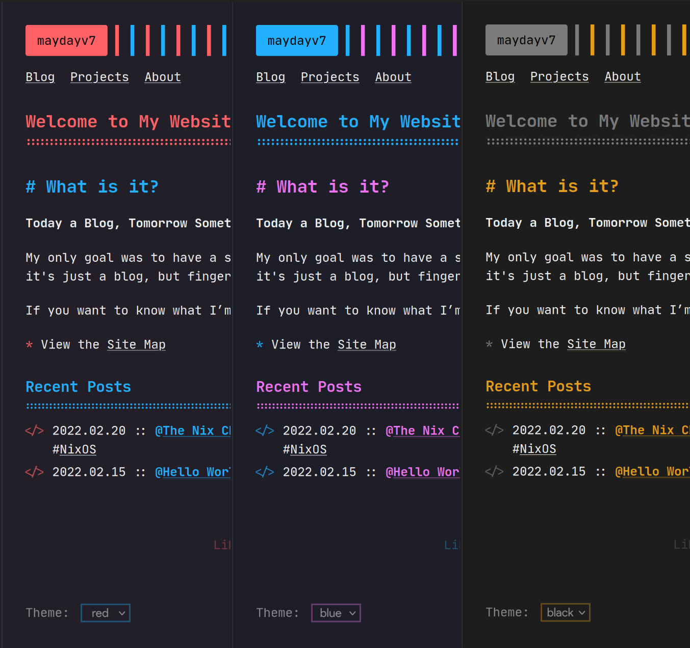

## My Personal Website

[](https://maydayv7.cc)

Built with [Zola](https://www.getzola.org/)  
Deployed via [Nix](https://nixos.org/) and [Cloudflare](https://www.cloudflare.com/)  
Hosted at [maydayv7.cc](https://maydayv7.cc)

### Build

You can grab all the required dependencies using `nix develop github:maydayv7/dotfiles#website` or `nix-shell`

For testing, run the following commands:

```
zola -r site check
zola -r site serve
```

Then click [here](http://localhost:1111)

To build the site, run `nix build`.
To override the URL, run: <pre><code>nix build --impure --expr "with import ../packages; callPackage ./site { site = <b><i>URL</i></b>; }"</code></pre>

#### Continuous Integration

[`GitHub Actions`](../checks/github/workflows/website.yml) is used to automatically build the site and deploy it to Cloudflare

### Features

- [x] Pagination
- [x] Categories
- [x] Social Links
- [x] Search
- [x] Analytics
- [x] Comments using [Disqus](https://disqus.com/)/[Giscus](https://giscus.app/)
- [x] Theme Switcher
- [x] Syntax Highlighting Theme
- [x] [KaTeX](https://katex.org/) Support -
  - Inline : `\\( \KaTeX \\)` / `$ \KaTeX $`
  - Block-Style : `\\[ \KaTeX \\]` / `$$ \KaTeX $$`
- Shortcodes -
  - [x] URL : <code>{{ url(path="<b>LINK</b>", text="<b>NAME</b>") }}</code>
  - [x] Image : <code>{{ image(src="<b>PATH</b>", alt="<i>Alternative Text</i>", position="<i>left</i>", style="<i>border-radius: 8px;</i>") }}</code>
  - [x] Figure : Extends Image - <code>{{ figure(caption_position="<i>left</i>", caption="<b>CAPTION</b>", caption_style="<i>font-weight: bold;</i>") }}</code>
  - [x] GitHub : Star Count - <code>{{ github(repo="<b>USER</b>/<b>NAME</b>") }}</code>
  - [x] YouTube : Embed Video - <code>{{ youtube(id="<b>ID</b>") }}</code>

## `git` frontend

The [`git`](./git) directory contains the configuration for my static `git` frontend, hosted at [git.maydayv7.cc](https://maydayv7.cc)  
It is built using my `stagit` [fork](https://github.com/maydayv7/stagit) to generate static HTML pages for my repositories  
To build it, run `nix run .#build-stagit`  
[`GitHub Actions`](../checks/github/workflows/website-git.yml) is used to automatically build the site and deploy it to Cloudflare every week
